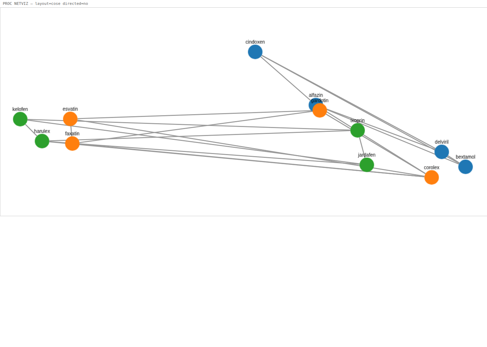

# 用 Jenner 进行 Neo4j 与网络分析

[Jenner](https://jenneranalytics.com) 把图数据库和网络分析带入了与
SAS 兼容的 DATA 步和 PROC 世界。用 `LIBNAME` 连接 **Neo4j** 或
**Memgraph**，用 **Cypher/GQL** 查询它们，运行图**算法**，绘制
**交互式网络图**，同时仍然使用**与 SAS 兼容的**网络优化和分析过程 ——
全部在同一个程序中完成。

本仓库展示了完整的技术栈，以一个真实世界的旗舰笔记本和一个无需
数据库的可视化演示为核心。所有内容均提供 **15 种语言**版本
（见[语言](#语言)）。

## 能力

### 新增 —— Jenner 的图家族（无 SAS 对应物）

| 功能 | 作用 |
|---|---|
| **`LIBNAME … GRAPH ENGINE=NEO4J`**（或 `MEMGRAPH`） | 把图数据库绑定到一个 libref，就像任何其他库一样。 |
| **`PROC GQL`** | 对图运行 **Cypher / GQL** 查询，并把结果集写入 Jenner 数据集。 |
| **`PROC LINKS`** | 对图运行图**算法** —— PageRank、社区检测、最短路径、中心性 —— 并把按节点/按边的结果写入数据集。 |
| **`PROC NETVIZ`** | 把图渲染为**交互式 Cytoscape.js** 网络图（在 Jupyter 内核中内联显示，或通过 CLI 生成一个自包含的 HTML 文件）。 |

### 与 SAS 兼容的网络过程

| 功能 | 作用 |
|---|---|
| **`PROC OPTNET`** | 对 Jenner 数据集进行网络**优化** —— 最短路径、TSP、最小成本流、连通分量、环、团等等。SAS/OR PROC OPTNET 的移植。 |
| **`PROC NETWORK`** | 对 Jenner 数据集进行经典网络**分析** —— 中心性、社区、双连通分量、路径。SAS Viya PROC NETWORK 的移植。 |

新家族作用于**实时图数据库**；与 SAS 兼容的过程则作用于你已有的
**链接/节点数据集**。它们可以组合：用 `PROC GQL` 拉取一个子图，
用 `PROC LINKS` 或 `PROC NETWORK` 为其打分，用 `PROC OPTNET` 优化，
再用 `PROC NETVIZ` 绘制它。

## 旗舰笔记本 —— ICIJ 离岸泄露欺诈分析

[`icij_fraud_analytics.ipynb`](icij_fraud_analytics.ipynb)
针对**真实的 ICIJ 天堂文件**泄露（163,435 个节点 —— 离岸实体、高管、
地址和中介）运行一条端到端的欺诈分析流水线。它用
`LIBNAME … GRAPH ENGINE=NEO4J` 连接，用 `PROC GQL` 探索，并用
`PROC NETWORK` 为风险打分 —— 一个完整的、以数据库为后端的图工作流。

> 该笔记本连接到一个 Neo4j 图（Jenner Workspace 平台托管着 ICIJ
> 数据集）。把 `LIBNAME` 指向你自己的 Neo4j/Memgraph，即可针对
> 你的数据运行它。

## 可视化演示 —— 无需数据库

[`../../demos/netviz_showcase/`](../../demos/netviz_showcase/) 从普通
数据集把一个离岸所有权图渲染为交互式网络图 —— 只用 `jenner` CLI
即可运行：

```bash
jenner demos/netviz_showcase/demo.jenner .
# -> demos/netviz_showcase/offshore_network.html
```



## 要求

- `jenner` 二进制文件在你的 `PATH` 上。
- 对于图家族（`LIBNAME GRAPH`、`PROC GQL`、`PROC LINKS`）：一个可达的
  **Neo4j** 或 **Memgraph** 实例，以及一个启用了 `neo4j` 特性构建的
  `jenner`。
- `PROC NETVIZ` 演示和与 SAS 兼容的过程无需数据库。

## 目录结构

```
notebooks/en/   旗舰 ICIJ 笔记本（英文）
demos/          netviz_showcase —— 无需数据库的网络图演示
i18n/<lang>/    每种语言的本地化 README + 笔记本
```

## 语言

每个语言文件夹都有一份本地化的 README 和一个翻译后的笔记本。
完整的语言列表请见[主 README](../../README.md)。

## 许可证

MIT。ICIJ 数据版权归 © ICIJ 所有，并依其条款使用；详见笔记本。
